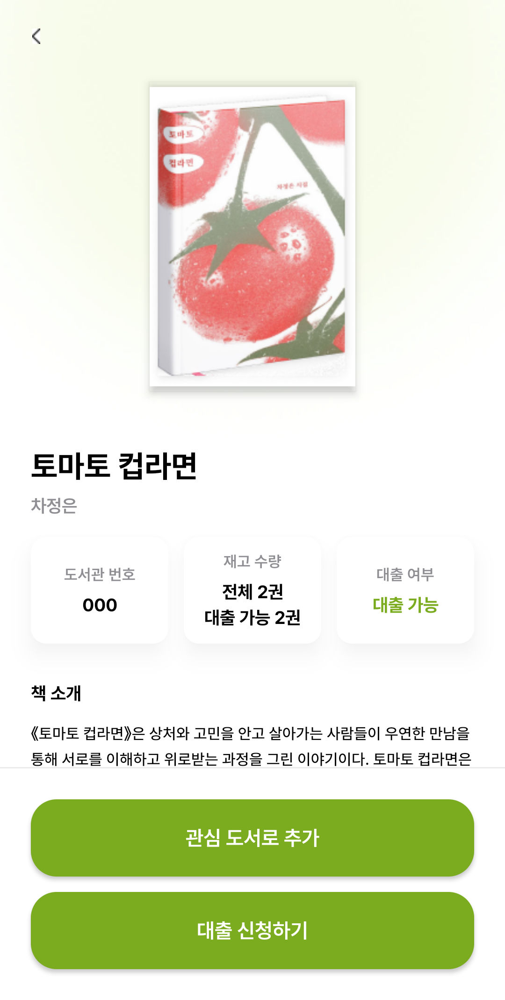
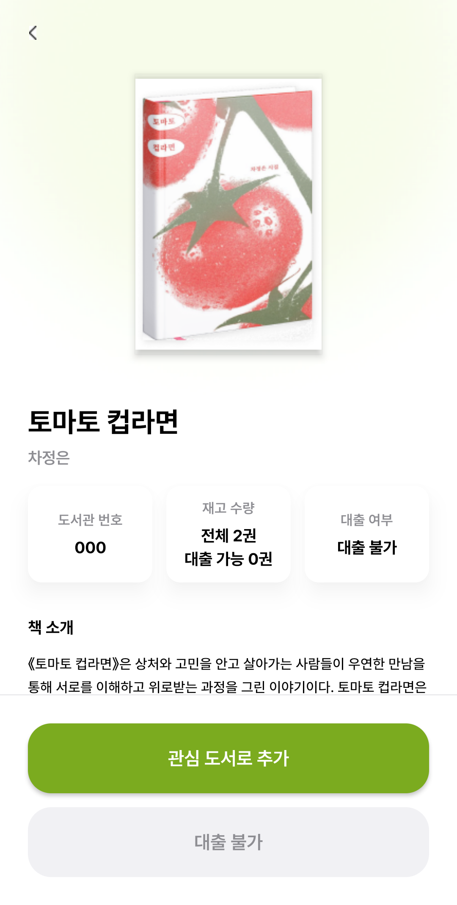
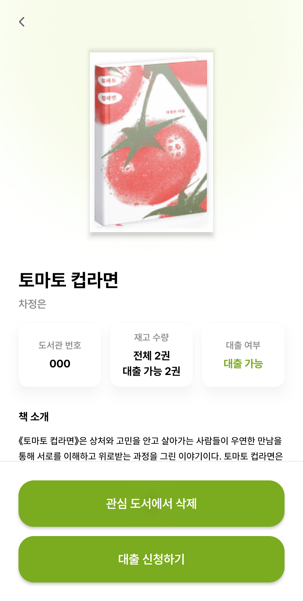
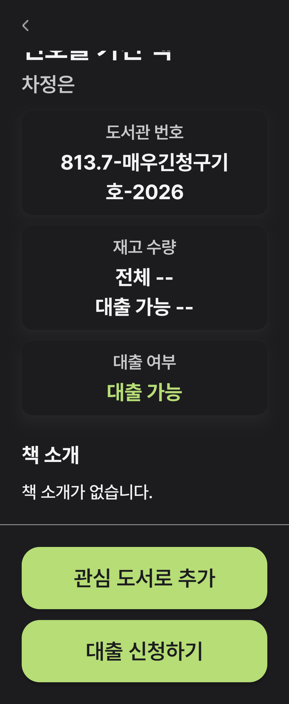

# 책 상세 화면 디자인·동작 검증

## 디자인 기준

Figma 플러그인의 `figma-design-to-code` 흐름으로 다음 실제 상세 노드의 디자인 컨텍스트와 캡처를 확인했다.

- [대출 가능](https://www.figma.com/design/nJLeurKROi9jA3Pul9cdAK/Bookon?node-id=164-214)
- [대출 불가](https://www.figma.com/design/nJLeurKROi9jA3Pul9cdAK/Bookon?node-id=164-403)
- [관심 도서](https://www.figma.com/design/nJLeurKROi9jA3Pul9cdAK/Bookon?node-id=166-531)

표지 160×240 비율, Pretendard 제목·저자·본문, 정보 카드 간격·모서리·그림자, 원본 배경과 뒤로가기 이미지를 Android 제약 기반 레이아웃으로 반영했다. 서버 표지 URL은 동적으로 유지하고 Figma 표지 파일은 테스트 fixture로만 사용한다. 다크 모드에서는 원본 뒤로가기 이미지의 흰 배경을 테마 표면으로 매핑한다.

사용자와 합의한 차이: 관심·대출 텍스트 버튼 두 개를 하단에 고정하고, 전체 재고와 대출 가능 재고를 함께 표시한다. Android 시스템 inset과 큰 글꼴에서는 화면·텍스트 크기에 맞춰 배치가 달라진다. Figma의 불가 시안에 남아 있는 `가능` 문구 대신 실제 서버의 대출 가능 여부를 표시한다.

## 검증 결과

- root: `:app:compileDebugKotlin`, `:app:testDebugUnitTest`(50개), `:app:lintDebug` 성공.
- 상세 관련 UI 테스트 13개씩 Android 14(API 34), API 37에서 모두 성공.
- 실제 Home 추천 컴포넌트의 책 ID callback, Search/NewBooks/Library Route와 Navigation 3 push/pop을 검증했다. 검색어·결과·스크롤·원래 탭 유지와 시스템 뒤로가기를 확인했다.
- 성공·초기 오류/재시도·대출 불가·관심 해제·중복 제출 차단·대출 상태 미확정·null 데이터·320dp/1.6배 글꼴/다크 UI를 검증했다.
- 최종 그림자 조정 뒤 API 34에서 상세 시각 테스트 7개를 다시 실행해 성공했다. 실제 가능·불가·관심·다크/큰 글꼴 캡처를 디자인과 대조했다.
- 배포 서버의 공개 `/books/8013595087` 조회: HTTP 200, errorCode 0. 전체/가용 수량과 대출 가능 필드 응답을 확인했다.

## 제한 및 발견 사항

로그인된 테스트 계정이 없어 실제 서버 관심 변경·대출 변경 요청은 실행하지 않았다. 변경 실패·중복 제출·재조회 실패는 fake Repository로 검증했다. 회전·프로세스 사망 복원은 이번 검증에 포함하지 않았다.

root 전체 UI 테스트(19개/기기)에서는 상세 관련 12개가 두 기기에서 통과했고, 범위 밖 `BookOnNotificationSettingsBottomSheetContentTest.notificationSwitches_updateTheirOwnSelection`이 `notification_switch_2` 노드를 찾지 못해 실패했다. 이를 상세 수정의 성공 결과로 숨기지 않는다. 이후 미확정 대출 UI 검증을 추가해 상세 범위는 13개가 됐다.

Android 최신 API에서 실패하던 Espresso 3.5.1을 기존 테스트 의존성 3.7.0으로 갱신했다. 앱 운영 의존성은 추가하지 않았다.

## 구조

책 ID → 상세 Route → ViewModel → 기존 UseCase → Repository → RemoteDataSource → DTO/Domain → StateFlow → Screen. 화면 이벤트는 Route에서 ViewModel/뒤로가기로 전달하며 기존 Hilt binding과 BuildConfig는 유지한다. 비동기 작업은 ViewModel 수명을 따르고 화면 객체를 장기 보관하지 않는다.

## 개별 PR 및 통합 검증

- #151 격리 작업트리: 컴파일·단위 테스트 55개·Lint·계측 Kotlin 컴파일 성공.
- #152 격리 작업트리: 컴파일·단위 테스트 46개·Lint·계측 Kotlin 컴파일 성공.
- #161 통합 작업트리: 컴파일·단위 테스트 119개·Lint·계측 APK 빌드 성공. 최종 상세 범위 15개씩 API 34/API 37 모두 성공(30개, 실패 0). 기존 버튼 테스트 2개는 승인된 세로 고정 텍스트 버튼 계약으로 갱신한 뒤 재실행했다.
- 기존 인기 목록의 신간 Screen 재사용은 title/empty 인자와 ScreenEvent 연결을 보존해 통합했다. 인기 목록의 별도 기기 복귀 테스트는 실행하지 않았다.

## 최종 API 34 캡처

