# 책 상세 화면 디자인·동작 검증

## 최종 승인 동작

- [대출 가능](https://www.figma.com/design/nJLeurKROi9jA3Pul9cdAK/Bookon?node-id=164-214), [대출 불가](https://www.figma.com/design/nJLeurKROi9jA3Pul9cdAK/Bookon?node-id=164-403), [관심 도서](https://www.figma.com/design/nJLeurKROi9jA3Pul9cdAK/Bookon?node-id=166-531) 실제 디자인 컨텍스트를 기준으로 구현했다.
- 배경은 시스템 상태 영역까지 그린다. 상단 콘텐츠와 48dp 뒤로가기/관심 터치 영역은 시스템 inset을 유지한다.
- 하단 고정 관심·대출 버튼을 제거하고 원본 빈/채운 하트로 관심 등록·해제를 표시한다. 이 변경은 상세 화면에 한정하며 다른 화면의 대출 기능과 공유 API/Domain은 유지한다.
- 도서 ID 조회로 표지·제목·저자·도서관 번호·전체/가용 재고·대출 가능 여부·책 소개를 표시한다. 정보 누락은 --로 표시한다.
- 표지 그림자는 고정 박스가 아니라 실제 표시된 이미지 경계에 맞춘다. 가로 표지·누락 URL·실패·URL 변경을 처리한다.

## 자산·구조

원본 배경/뒤로가기 이미지와 Figma 하트 SVG 전체를 투명 PNG 3x Android 자산으로 변환해 사용한다. 외부 앱 운영 dependency를 추가하지 않았다. 운영 표지는 서버 URL을 유지하며 Figma 표지 이미지는 계측 fixture에만 사용한다.

책 ID → Route → ViewModel → 기존 UseCase → Repository → RemoteDataSource → DTO/Domain → StateFlow → Screen 경계를 유지한다. 상세 대출 이벤트/상태/주입만 제거했다. 기존 관심 목록 복귀 동기화와 탐색 경쟁 보호를 보존하며 Hilt binding·BuildConfig·공유 API 계약은 변경하지 않았다.

## 검증

- root 단위 테스트 48개 및 컴파일·Lint 성공. 상세 UI 17개씩 API 34/API 37 성공(34개).
- #151 격리 작업트리 단위 테스트 53개·컴파일·Lint·계측 Kotlin 컴파일 성공.
- #161 통합 작업트리 단위 테스트 117개·컴파일·Lint·계측 APK 성공. 최종 상세 패키지 계측 19개씩 신규 격리 API 34/API 37 모두 성공(38개, 실패 0).
- 조회 실패·기존 콘텐츠 보존·재시도·관심 변경 실패·중복 클릭·요청 중 재조회 보호·오래된 응답을 fake Repository로 검증했다.
- 홈 callback과 검색·신간·도서실 실제 Route 복귀의 검색어·목록·스크롤·탭을 검증했다.
- 실제 MainActivity에서 UiAutomation 물리 화면 캡처로 시스템 상태 영역 배경, 콘텐츠 inset, 하트 터치 영역을 검증했다. Window APPEARANCE_LIGHT_STATUS_BARS 및 시스템 UI idle을 함께 확인했다. 정상 글꼴의 신규 격리 AVD API 34/API 37에서 root 17개씩 모두 통과했다.

## 제한

배포 서버 공개 상세 GET은 이전 확인에서 HTTP 200/errorCode 0을 반환했다. 로그인 계정이 없어 실서버 관심 변경을 실행하지 않았으며 성공·실패·중복 요청은 fake Repository로 검증했다. 상세에서 대출 요청은 제공하지 않는다. 회전·프로세스 사망 복원 및 인기 목록 별도 기기 복귀는 미검증이다.

이전 root 전체 UI 실행에서 범위 밖 알림 설정 테스트의 notification_switch_2 태그 누락 실패가 발견됐다. 이 문제를 수정하거나 상세 성공에 포함하지 않았다. Espresso 3.7.0은 이전 API 37 계측 호환 변경이며 이번 UI 수정에서 새 의존성을 추가하지 않았다.

## 추가 실행의 환경 차이

초기 공유 API 37 기기의 추가 11개 실행에서 3개 실패(Compose hierarchy 부재 2개, 물리 픽셀 검증 1개)가 발생했다. 해당 기기 전역 font_scale=2와 다른 앱의 foreground가 관측됐으나 정확한 실패 원인으로 단정하지 않는다. 기존 기기 설정을 바꾸지 않고 새 격리 AVD를 만들어 재검증했다. 최종 증거는 이 격리 실행과 아래 캡처를 사용한다.

## 최종 캡처

### API 34

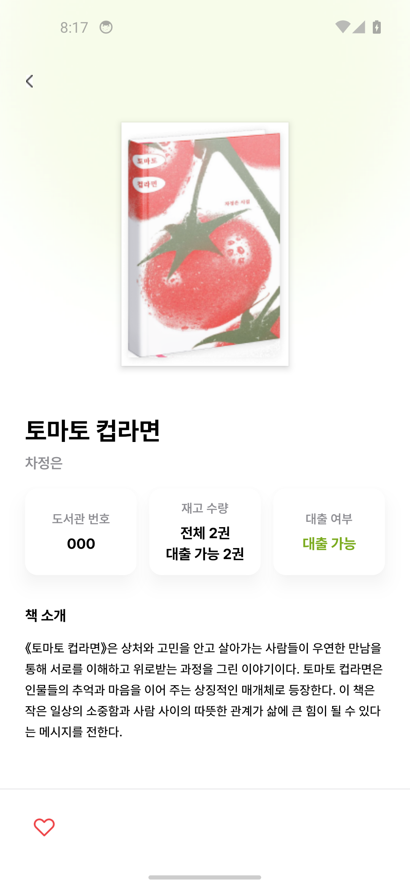

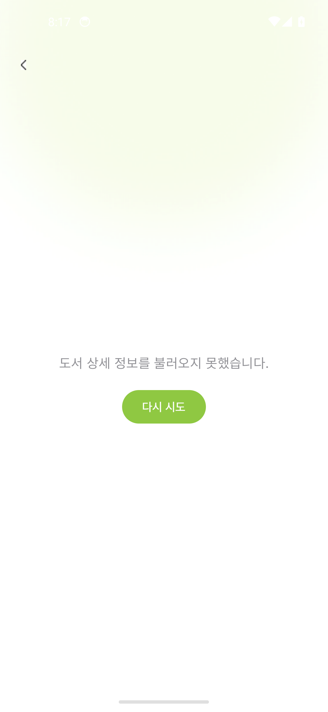

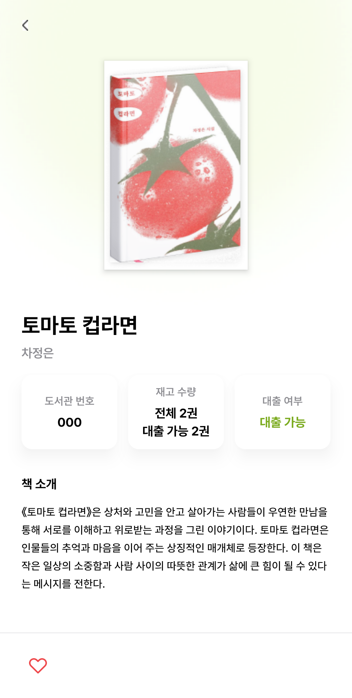

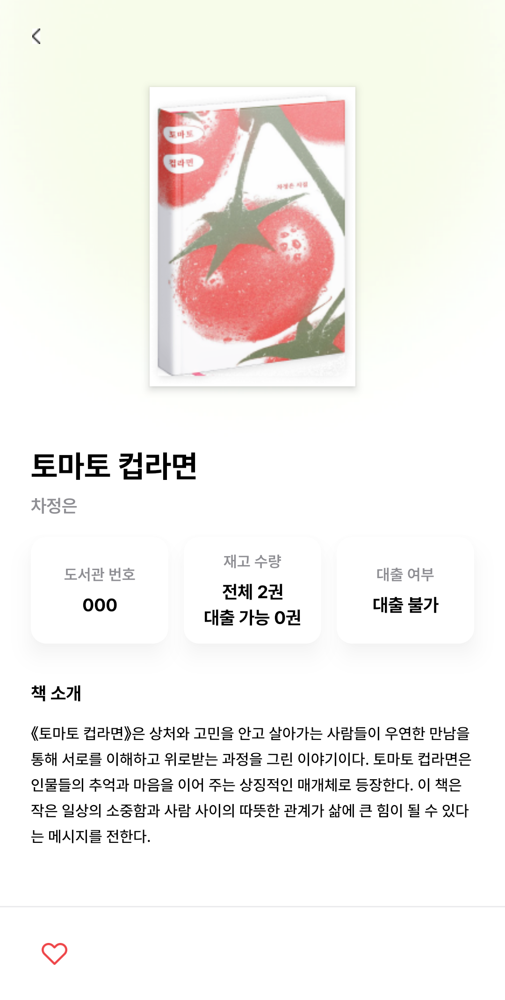

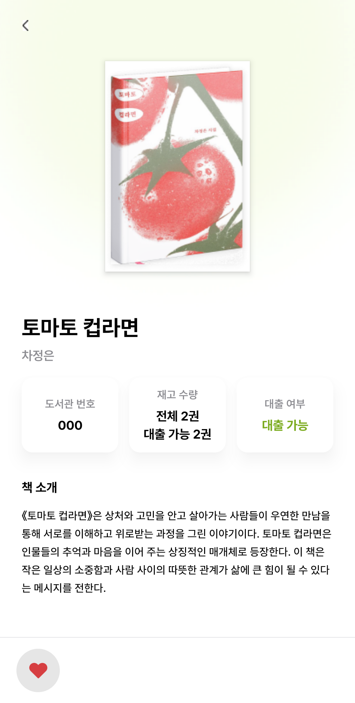

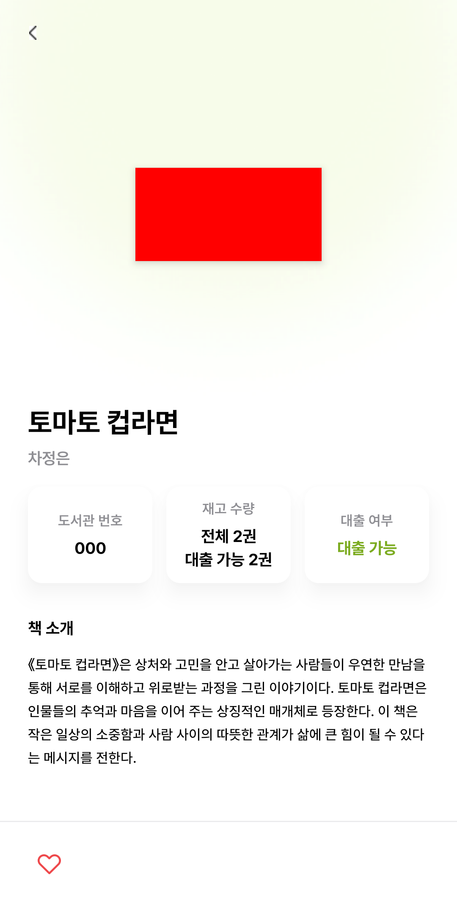

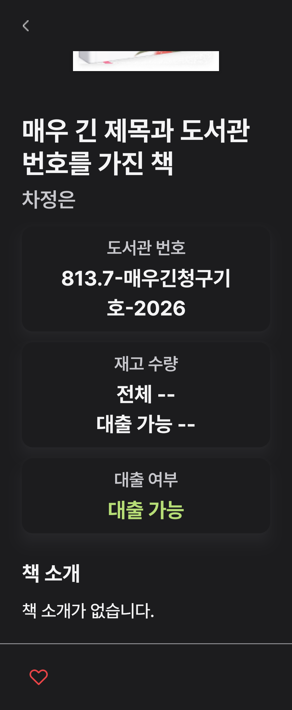

### API 37

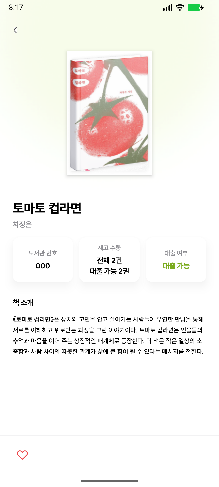

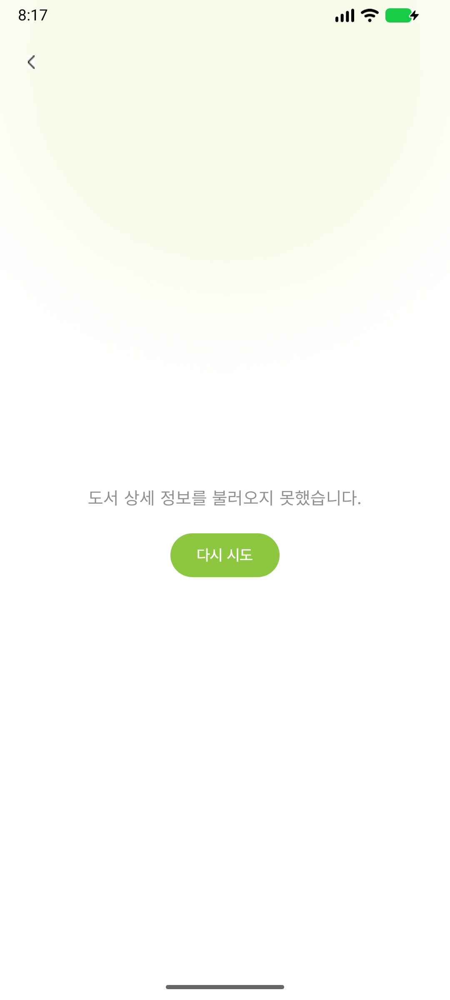

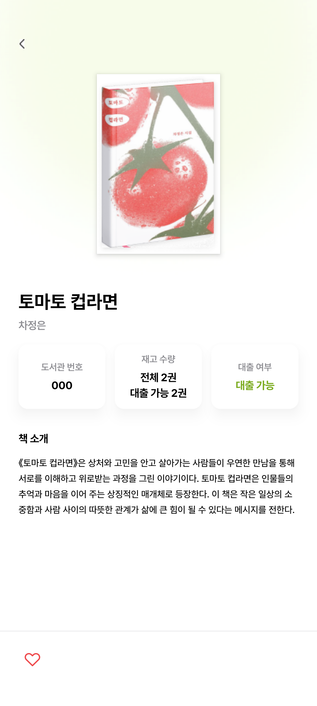

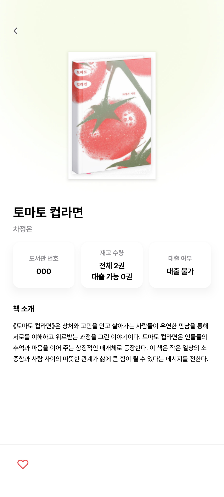

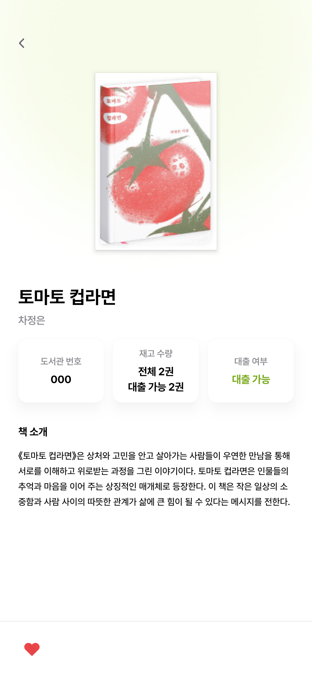

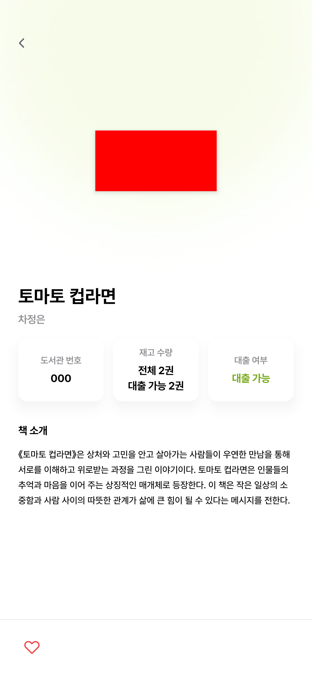

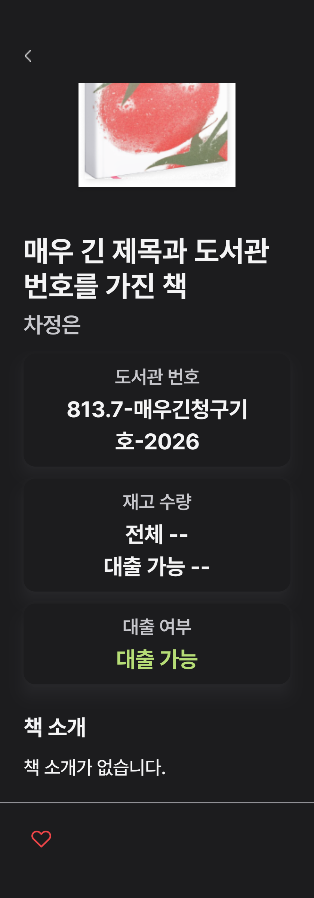
